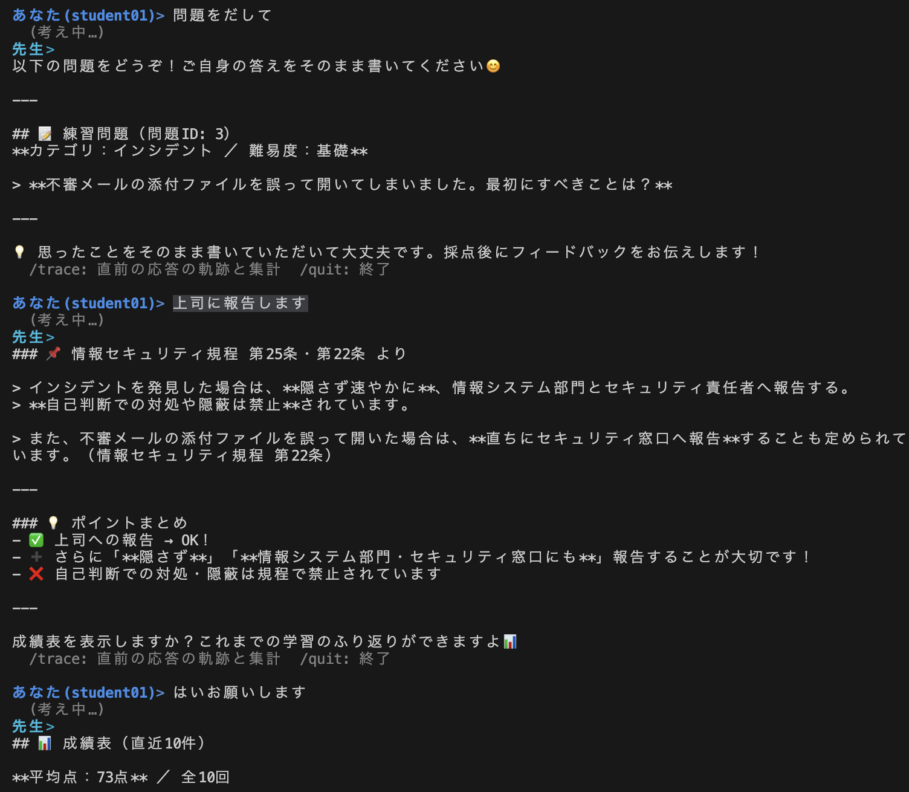

# AI Hub Learning Demo

「**ハーネスエンジニアリング(Harness Engineering)**」と「**InterSystems AI Hub**」を紹介する記事のためのデモリポジトリです。
軽量な IRIS を Docker で動かし、AI Hub で作った 2 つのエージェントを用意しています。

- **先生エージェント** — 社内セキュリティ規程の研修を題材に、ツール(規程検索・採点・作問など)を持ち、
  呼び出す人の権限(IRIS の RBAC)で見えるツール・取れる行動が変わる。永続監査や人間の承認も備える。
- **プレインエージェント** — ツールを持たず、LLM と会話するだけの最小構成。



*生徒(student01)として先生エージェントと対話しているところ(`TalkAs`)。出題 → 解答 → 規程を引用した解説 → 成績表の提案。*

## 事前準備(IRIS イメージのロード)

このデモは AI Hub の早期アクセスプログラム(EAP)版 IRIS コミュニティエディションのコンテナイメージを使います。
**ビルド 136**(`2026.3.0AI.136.0`)で動作を確認しています。EAP はリリース前のため、ビルドによって動作が変わる可能性があります。

1. Docker と Docker Compose V2(`docker compose version` が `v2.x`)を用意します。
   **Windows の場合は WSL2 が前提です**: Docker Desktop(WSL2 バックエンド)を使い、以降のコマンドは
   WSL2 のシェル(Ubuntu など)で実行します。リポジトリも WSL2 側で `git clone` してください
   (Windows 側(`C:\…`)に置くと、改行コードの変換でスクリプトが動かないことがあり、バインドマウントも遅くなります)。
2. [コミュニティエディションのダウンロードページ](https://evaluation.intersystems.com/Eval/index.html)で
   **Early Access Program** を選び、**AI Hub** のコンテナイメージをダウンロードします(アカウント登録が必要です。
   手順は「[コミュニティエディションのダウンロード方法](https://jp.community.intersystems.com/node/530121)」を参照)。
   arm64(Apple シリコンなど)の場合は `iris_arm64-community-…-docker.tar.gz` を選びます。
3. ダウンロードしたファイルを Docker にロードします(ファイル名はダウンロードしたものに置き換えます)。

   ```bash
   docker load -i iris-community-2026.3.0AI.136.0-docker.tar.gz
   docker images | grep iris-community   # ロードされたイメージ名:タグを確認
   ```

4. ロードされたイメージ名:タグが次と異なる場合(入手時期で異なることがあります)は、
   [Dockerfile](Dockerfile) の `ARG IMAGE` を書き換えます。

   ```
   docker.iscinternal.com/docker-intersystems/intersystems/iris-community:2026.3.0AI.136.0
   ```

## クイックスタート

先生エージェントと対話するところまでの最短手順です。

```bash
# 1. ビルド & 起動。初回起動で IRISSECURITY の暗号化まで自動で行われる(数分)
cp .env.example .env          # 任意(ホスト側ポートを変える場合)
docker compose up -d --build
docker compose logs -f iris | grep "\[demo\]"   # 「暗号化を確認しました(EncryptedDB=1)」まで待つ

# 2. LLM の API キーを Wallet に登録(非表示入力)。openai / anthropic / bedrock のどれか1つ
docker compose exec -it iris bash /home/irisowner/dev/docker/register-key.sh openai

# 3. 教材の投入・ベクトル索引の構築と、デモ用のロール/ユーザの作成
docker compose exec -T iris iris session iris -U DEMO <<'OBJ'
 do ##class(Demo.Teacher.Setup).Rebuild()
 do ##class(Demo.Teacher.Security).SetupRBAC()
 halt
OBJ

# 4. IRIS セッションに入る(日本語を表示するため -it)
docker compose exec -it iris iris session iris -U DEMO
```

```objectscript
; 5. 生徒(student01)として先生エージェントと対話する。パスワードは demo
DEMO> do ##class(Demo.Teacher.RunAs).TalkAs("student01")
あなた(student01)> 情報持ち出しについて教えてください。
あなた(student01)> /trace      ; 直前の応答の軌跡(ツール呼び出しなど)を表示
あなた(student01)> /quit       ; 終了(IRIS セッションも閉じる)
```

設問管理者として作問を試すときは、セッションを開き直して `TalkAs("qadmin01")` を実行します。

各手順の説明は
[docs/guide/demo-runbook.md](docs/guide/demo-runbook.md) を参照してください。

環境の詳細は [docs/guide/building-blocks/docker.md](docs/guide/building-blocks/docker.md) を参照してください。

## アクセス制御と Human-in-the-loop

先生エージェントには、生徒(`student01`)と設問管理者(`qadmin01`)の 2 つの役割があります。

- **アクセス制御** — 採点・成績表は生徒だけ、作問は設問管理者だけが使えます。判定はプロンプトではなく
  IRIS の RBAC(リソース / ロール)で行い、権限の無いツールは LLM に渡すツール一覧から除外されます
  (呼ばれても実行時に拒否)。採点基準のテーブルは生徒に SQL の権限を与えず、採点はサーバ側で行います。
- **Human-in-the-loop** — 設問管理者が作った設問は、教材に登録する直前に人間が確認します。
  承認 / 却下のほか、「もっと難しく」のような指示で差し戻すと、エージェントが作り直して再提案します。
- **記録** — ツールの実行と、承認・権限拒否の判断は、実行ユーザ名とともに監査テーブルに残ります。
  対話中は `/trace` で直前の応答の軌跡を確認できます。

## API キーの保護

LLM の API キーは IRIS の **Secure Wallet** に格納し、エージェントからは ConfigStore の参照だけで扱います。
Wallet の実体は `IRISSECURITY` データベースにあり、このデータベースを暗号化しておくことで、
API キーは**保存時(at-rest)にも暗号化**されます。ソースや設定ファイルに平文のキーは残りません。


## ドキュメント構成

手順と説明は **[docs/guide/](docs/guide/)** にあります。通しで実践する手順は
**[docs/guide/demo-runbook.md](docs/guide/demo-runbook.md)(実践ガイド)** を参照してください。

**構成要素(building-blocks)** — エージェントが安全に動く土台:

| 構成要素 | ガイド |
|---|---|
| Docker で動作する IRIS 環境 | [guide](docs/guide/building-blocks/docker.md) |
| IRISSECURITY の暗号化 | [guide](docs/guide/building-blocks/encryption.md) |
| Wallet で OpenAI / Claude / Bedrock のキー受け渡し | [guide](docs/guide/building-blocks/wallet.md) |

**エージェント(agents)** — 上記の土台の上で動かす:

| エージェント | ガイド |
|---|---|
| プレインエージェント(会話するだけの最小構成) | [guide](docs/guide/agents/plain-agent.md) |
| 先生エージェント(権限で振る舞いが変わる発展形) | [guide](docs/guide/agents/teacher-agent.md) |

## リポジトリ構成

```
.
├── README.md                     この文書(入口)
├── Dockerfile                    IRIS(AI Hub EAP)イメージのビルド。ビルド時に merge.cpf と iris.script を適用
├── docker-compose.yml            コンテナ定義(ポート・ソースのマウント・Durable %SYS ボリューム)
├── merge.cpf                     CPF マージ: DEMO 名前空間(DEMO_DATA / DEMO_CODE)の作成
├── iris.script                   ビルド時の初期設定(パスワード無期限化・ZPM 導入など)
├── requirements.txt              Embedded Python 用パッケージ(MCP 関連)
├── .env.example                  .env のサンプル(ホスト側ポート。API キーは書かない)
├── .iris-agentic-dev.toml.example  iris-agentic-dev(IRIS 操作用 CLI / MCP)の接続設定サンプル
├── .vscode/settings.json         VS Code の ObjectScript 拡張をコンテナへ接続する設定
├── docker/
│   ├── start.sh                  エントリーポイント: IRIS 起動を待って初回初期化・ソースのロード
│   ├── first-boot-encrypt.sh     初回起動時だけ IRISSECURITY を暗号化(構成要素: 暗号化)
│   └── register-key.sh           LLM の API キーを Wallet + ConfigStore に手動登録(構成要素: Wallet)
├── src/Demo/
│   ├── Agent/
│   │   ├── Base.cls              共通ベースエージェント(ConfigStore から LLM プロバイダを自動採用)
│   │   └── Plain.cls             プレインエージェント(ツールなし・会話だけ)
│   └── Teacher/                  先生エージェント(クラスの役割は agents/teacher-agent.md の表を参照)
│       ├── Teacher.cls           エージェント本体(対話モード・trajectory 表示)
│       ├── ToolSet.cls           ツールセット(RoleGuard と監査ポリシーを付与)
│       ├── Tools/                ツール: Catalog(設問一覧)/ Study(採点・成績表)/ Authoring(作問)
│       ├── RoleGuard.cls         権限ゲート(RBAC)+ 人手承認ゲート
│       ├── Security.cls          デモ用のリソース・ロール・ユーザを作成
│       ├── RunAs.cls             別ユーザの権限での実行・比較、監査ログの表示
│       ├── Monitor.cls           trajectory の観測(反復数・トークン)
│       ├── Setup.cls             教材データの投入とベクトル索引の構築
│       ├── Policy.cls / Question.cls / AnswerKey.cls / Progress.cls
│       │                         データ: 社内規程 / 設問 / 模範解答・採点基準 / 学習履歴
│       └── Audit/                永続監査: PersistentAudit(監査ポリシー)/ ToolCallLog(事象)/ RunLog(ラン)
├── docs/
│   ├── images/                   README などで使う画像
│   └── guide/                    手順と説明(demo-runbook.md = 通しの実践ガイド)
│       ├── building-blocks/      docker.md / encryption.md / wallet.md
│       └── agents/               plain-agent.md / teacher-agent.md
└── local/                        ローカル専用(Git 管理外。README.md のみコミット)
```

`src/` 配下はコンテナ起動時に DEMO 名前空間へロード・コンパイルされます(`docker/start.sh`)。

## 技術スタックの前提

- ベースイメージ: **iris-community**(AI Hub EAP IRISコミュニティエディション)
- AI Hub SDK: `%AI.*`(`%AI.Tool` → `%AI.ToolSet` → `%AI.Agent` / `%AI.MCP.Service`)
- LLM プロバイダ: このデモは OpenAI / Anthropic(Claude)/ Amazon Bedrock に対応。
  AI Hub 自体はほかにも Gemini / Vertex AI・xAI・DeepSeek などに対応し、Ollama などのローカル LLM も
  OpenAI 互換 API で利用できます([ai-hub-eap の SDK ガイド](https://github.com/intersystems-community/ai-hub-eap/blob/master/ObjectScript_SDK_Guide.md))

## まとめ - InterSystems IRIS AI Hub の特徴

このデモを通じて、以下を実感いただたら幸いです。

- **データとエージェントが近い** — エージェントとツールは IRIS の中で動き、SQL・オブジェクト・ベクトル検索に
  ネットワークを介さずアクセスします。ツール実行は高速です。
  ただしLLM の推論は使うモデル・プロバイダに依存します。
- **既存のロール・権限をそのまま使える** — ツールの可視性・実行可否を IRIS のユーザ / ロール / リソースで制御します。
  同じ ID が SQL の権限と監査記録にも通るので、AI 用に別の権限体系を作る必要がありません。
- **秘密情報と記録もプラットフォーム内** — API キーは Wallet(暗号化された IRISSECURITY)に置き、
  ツール実行・承認の記録は同じ DB に残るので、後から SQL で照会できます。

